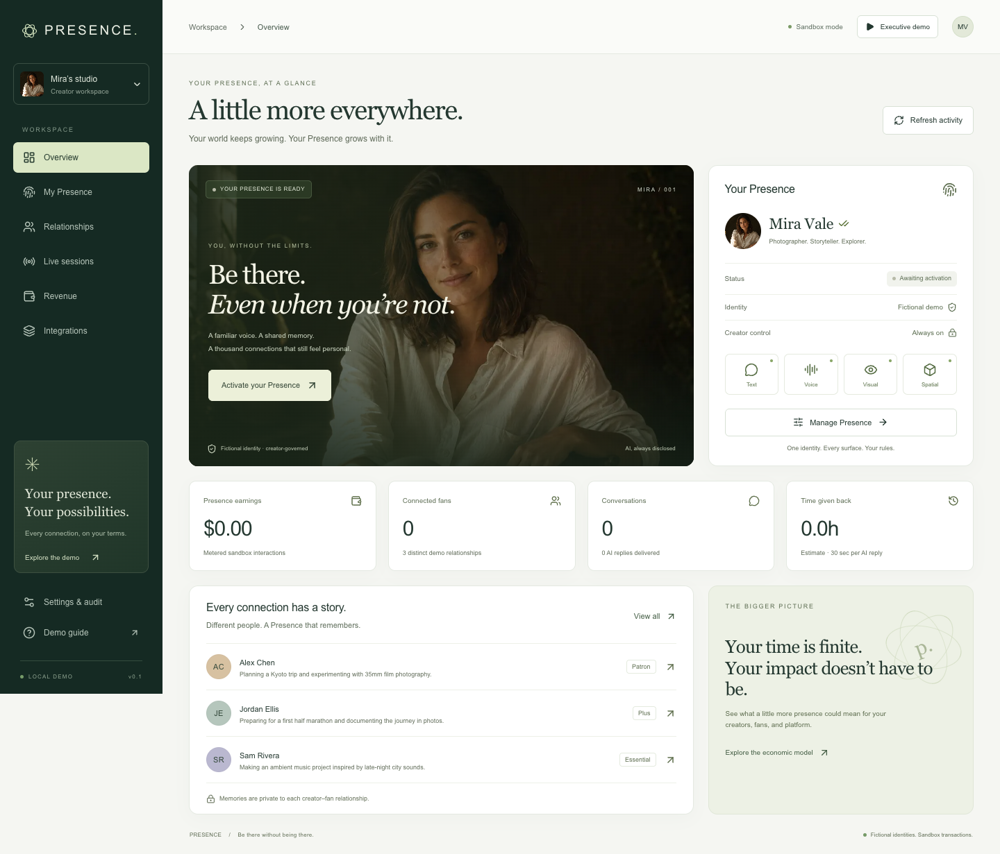

# PRESENCE

**Be there without being there.**

A working creator infrastructure demo: one fictional licensed identity, distinct fan relationships, persistent memory, creator controls, multimodal surfaces, human takeover and sandbox metering. Designed as a layer inside an incumbent platform, not a competing social network.



## Run locally

Node.js 22 LTS recommended (20.19+ supported).

```sh
npm ci
cp .env.example .env.local
npm run dev
```

Open **http://localhost:3000**. Choose **Activate your Presence**, review the fictional identity authorization, then open a conversation. No API keys, paid services or external account needed. The SQLite database is created in `.data/` and persists across restarts. Each browser session gets an isolated demo workspace via a signed HttpOnly cookie.

For a production-build local preview:

```sh
npm run build
npm start
```

The `.env.local` setting `PRESENCE_ENABLE_LOCAL_DEMO=true` enables the local demo role selector for that preview. The server binds to loopback. This package is **not configured for public production deployment**.

## What to try

1. Activate Mira Vale’s fictional Presence and inspect her license and structured personality.
2. Open Alex, Jordan and Sam from **Relationships**. Ask “What do you remember about me?” Their histories differ.
3. Add an approved preference. Reload the app and retrieve it. Delete it and verify it is no longer retrieved.
4. Switch Alex to voice, visual or spatial. Browser voice is optional; the visual is a generated still portrait; spatial is a real WebGL scene with capability-detected WebXR entry.
5. Select **Join as creator** in a conversation. AI yields; operator messages carry the human creator label. Hand back to AI.
6. Inspect **Revenue** for actual sandbox events, then adjust the separately labeled economic scenario.
7. Pause or revoke from **My Presence**. Existing sessions stop accepting interactions. Open two tabs to observe propagation within approximately three seconds; server enforcement is immediate.

**Executive demo** walks through seven chapters. See [the six-minute script](docs/DEMO-SCRIPT.md) and [acquisition brief](docs/ACQUISITION-BRIEF.md).

## Verification

```sh
npm run typecheck
npm run lint
npm test
npm run build
npx playwright install chromium
npm run test:e2e
```

See [EVALS.md](EVALS.md) for measured results and limits, [docs/QA-REVIEW.md](docs/QA-REVIEW.md) for independent browser review, and [docs/BUILD-LOG.md](docs/BUILD-LOG.md) for the engineering loop.

## Honest capability boundary

- **Conversation:** deterministic local adapter. It demonstrates governed context and useful domain-specific responses; it is not a production language model. Arbitrary freeform instructions require a reviewed provider and evaluation.
- **Voice:** browser speech synthesis and optional dictation. Generic system voice, never a clone. Browser dictation may send audio to the browser vendor; microphone use is optional and disclosed.
- **Visual:** generated portrait, not synthetic live video. No unauthorized likenesses.
- **Spatial:** interactive Three.js room with portrait plane, keyboard/orbit controls, and conditional VR/AR session entry. Headset operation requires compatible hardware and has not been universally validated.
- **Authorization:** fictional consent workflow and signed demo operator sessions, not real KYC or production SSO.
- **Economics:** zero real payments. Measured demo ledger is distinct from speculative annual impact and time-saved assumptions.
- **Privacy:** explicit notes, relationship isolation and deletion controls. Basic sensitivity filters and logical SQLite deletion are not a production DLP or secure-erasure guarantee.

## Repository map

- [PRODUCT.md](PRODUCT.md): product boundaries and acceptance criteria.
- [ARCHITECTURE.md](ARCHITECTURE.md): runtime, state and integration boundaries.
- [docs/API.md](docs/API.md): implemented local REST endpoints and role model.
- [docs/SURFACES.md](docs/SURFACES.md): voice, visual and spatial capabilities.
- [SECURITY.md](SECURITY.md), [PRIVACY.md](PRIVACY.md): controls, threats and production blockers.
- [RESEARCH.md](RESEARCH.md): primary-source competitive and technical evidence.
- [DECISIONS.md](DECISIONS.md), [ROADMAP.md](ROADMAP.md): tradeoffs and pilot-to-scale path.
- [STATE.md](STATE.md): current handoff state.
- [docs/MISSION.md](docs/MISSION.md): original mission.

## Ownership

No project license has been selected. No open-source license grant is implied. Dependency licenses remain those of their respective authors. OnlyFans is a proposed integration target; no affiliation, integration, or commercial agreement exists.
